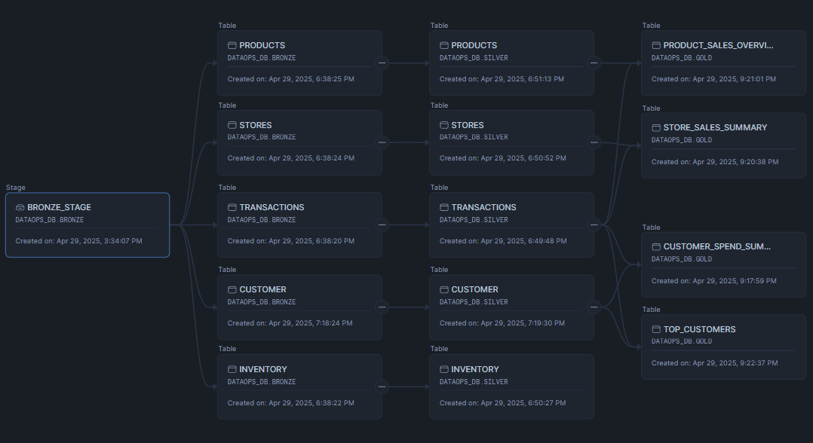
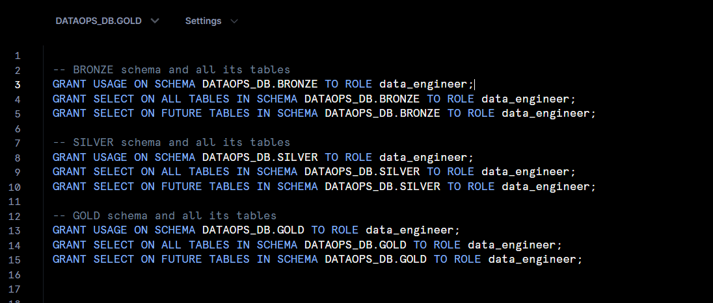
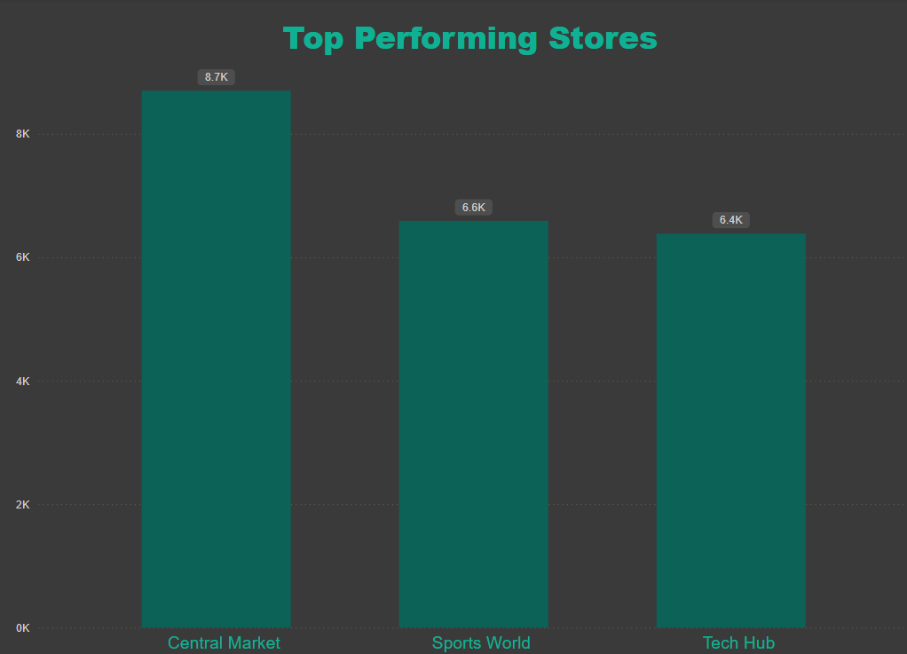
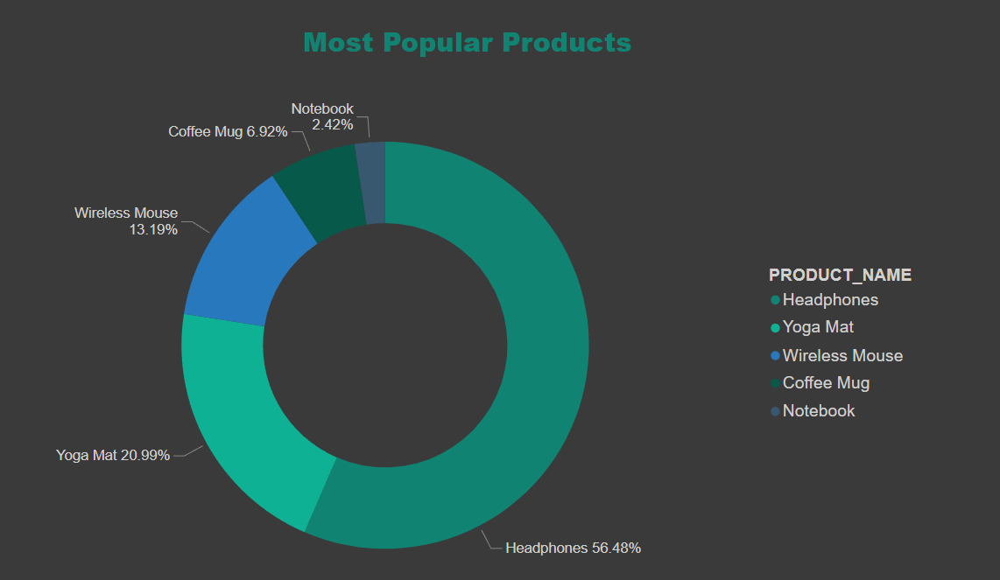
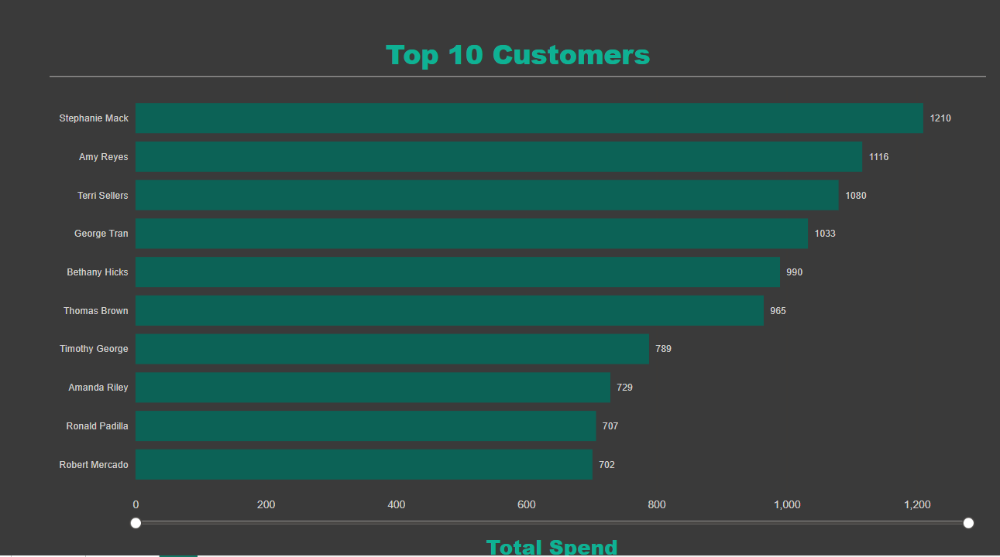

# DataOps Pipeline Project

## Overview

This DataOps project showcases the integration of data engineering and DevOps principles to build a scalable, secure, and automated data pipeline. The pipeline supports end-to-end workflows from raw data ingestion to BI reporting using a layered architecture (Bronze, Silver, Gold). 

Infrastructure is provisioned and maintained using Terraform (IaC), data is processed using Python and stored in AWS S3, and insights are visualised through Power BI, while leveraging Snowflake as the data warehouse.

## Key Features

- **Data Extraction**: CSV datasets were downloaded and structured into tables.
- **Infrastructure Setup**: Snowflake objects (warehouse, database, schema) created using Terraform.
- **Data Transformation & Loading**: Python used for transformations. Data loaded to Snowflake via AWS S3 stages.
- **Layered Architecture**: Implemented Bronze → Silver → Gold layers to organise the data.
- **Access Control**: Role-based access control (RBAC) implemented using SQL scripts.
- **Analytics**: Dashboards built using Power BI.

---

## Architecture

### Snowflake Data Architecture

A layered data architecture was implemented, moving data through Bronze, Silver, and Gold layers.



---

## Workflow


### 1. Data Storage

The CSV files were uploaded into an AWS S3 bucket in a structured layout.


---

### 2. Infrastructure Setup

Terraform was used to provision:
- Snowflake database: DATAOPS_DB
- Schemas: BRONZE, SILVER, GOLD
- Warehouse: DATAOPS_WH

```hcl
resource "snowflake_database" "data_ops" {
  name = var.database_name
}

resource "snowflake_schema" "bronze" {
  name     = "BRONZE"
  database = snowflake_database.data_ops.name
}

```

### 3. Data Transformation(Python) 
A Python script using boto3 and snowflake.connector was used to:
- Upload data to S3
- Create tables in Snowflake
- Load data using COPY INTO to Bronze stage

### 4. Data Loading to Snowflake

An external stage was configured in Snowflake pointing to the S3 bucket. Data was loaded into the Bronze layer and promoted to Silver and Gold using SQL transformations.

### Layered Model

- Bronze Layer: Raw CSVs loaded directly from S3 via COPY INTO.

- Silver Layer: Cleaned data with type casting, joins, and formatting.

- Gold Layer: Final aggregations for analytics.

### **5. Access Control**
- **Role-based access control (RBAC)** applied for secure user permissions
- Separate roles for **data engineers** and **analysts** ensure data governance

**Access Control SQL Configuration**  

  

### **6. Analytics & Dashboards (Power BI)**
Power BI connects to the **Gold layer** for business-ready dashboards.

#### **Example Insights**  

**Top Performing Stores**  
  


**Most Popular Products**  

  


**Top 10 Customers**  

  


### Results

Scalable Snowflake data pipeline across 3 layers.

Python automation for S3 + Snowflake integration.

Role-based access configured for secure data operations.

Power BI visuals connected directly to Snowflake Gold layer.

### Technologies Used
Snowflake: Data warehouse platform.

Terraform: Infrastructure as Code (IaC) for Snowflake setup.

AWS S3: Cloud object storage.

Python: Used for uploading files and initiating data load.

Power BI: Dashboard and reporting.

### Future Improvements
Integrate orchestration using Apache Airflow.

Add alerting and monitoring using CloudWatch or Snowflake alerts.

Implement CI/CD with automated deployments.

Add scheduled refresh for Power BI dashboards to get live updates.

Include more visualisations to support better data-driven decisions.


